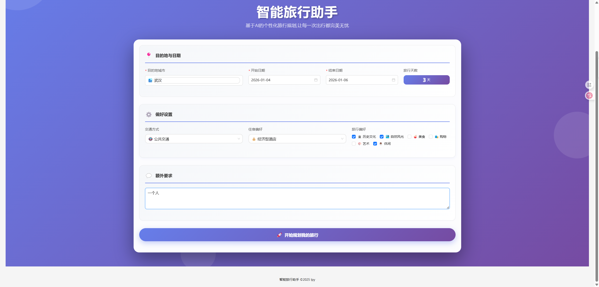
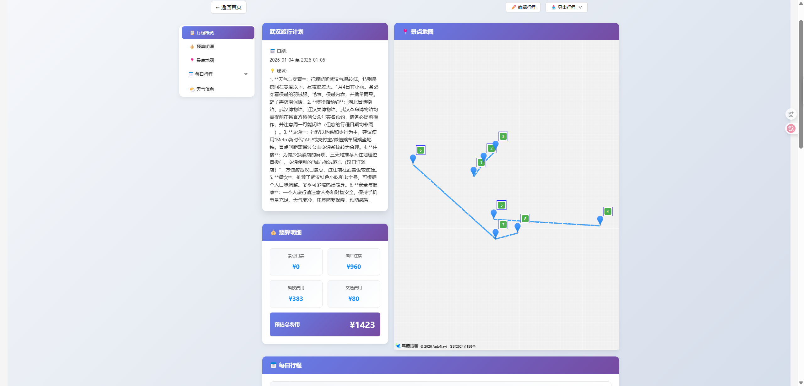
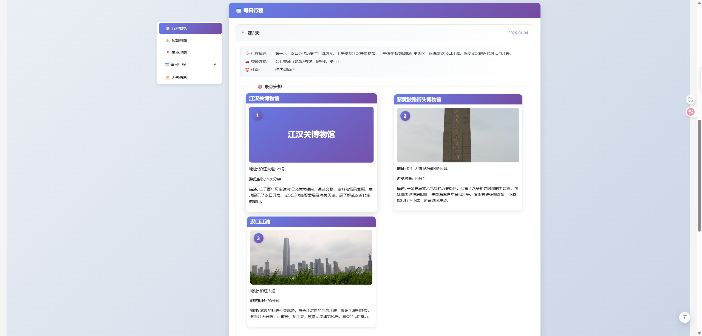
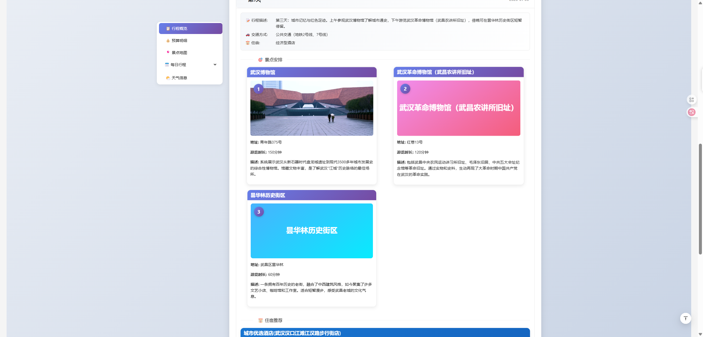

# 智能旅行助手 (Smart Travel Assistant)

一个基于 AI 的智能旅行规划系统，利用多智能体协作技术，为用户提供个性化、智能化的旅行方案。


## 功能特性

- 🤖 **多智能体协作**：景点搜索、天气查询、酒店推荐、行程规划四大智能体协同工作
- 🗺️ **智能地图集成**：基于高德地图 API 的地理位置服务和 POI 搜索
- 🌤️ **实时天气查询**：提供目的地天气信息，优化行程安排
- 🏨 **智能酒店推荐**：根据用户偏好推荐合适的住宿选择
- 📝 **行程规划**：自动生成详细的每日行程安排
- ✏️ **行程编辑**：支持在线编辑和自定义行程
- 📥 **多格式导出**：支持导出为图片或 PDF 文档
- 🎨 **现代化 UI**：基于 Ant Design Vue 的响应式界面设计
- 📱 **移动端适配**：完美支持各种设备尺寸

## 技术栈

### 后端

- **框架**：FastAPI 0.128+
- **Python 版本**：3.11+
- **AI 模型**：OpenAI 兼容接口（支持 DeepSeek、Qwen 等）
- **外部服务**：
  - 高德地图 API（POI 搜索、地理编码）
  - Unsplash API（图片资源）
- **工具库**：
  - FastMCP（多智能体框架）
  - Pydantic（数据验证）
  - Uvicorn（ASGI 服务器）

### 前端

- **框架**：Vue 3.5+
- **语言**：TypeScript 5.7+
- **构建工具**：Vite 6.0+
- **UI 组件库**：Ant Design Vue 4.2+
- **路由**：Vue Router 4.5+
- **HTTP 客户端**：Axios
- **地图组件**：高德地图 JavaScript API
- **导出功能**：html2canvas、jspdf

## 项目结构

```
smartTrain/
├── backend/                 # 后端服务
│   ├── app/
│   │   ├── agent/          # 多智能体实现
│   │   │   ├── plans_agent.py      # 行程规划智能体
│   │   │   └── simple_agent.py     # 简单智能体基类
│   │   ├── api/            # API 路由
│   │   │   └── router/
│   │   │       ├── trip.py         # 旅行规划接口
│   │   │       ├── poi.py          # POI 搜索接口
│   │   │       └── map.py          # 地图相关接口
│   │   ├── Client/         # MCP 客户端
│   │   │   └── MyMCPClient.py      # MCP 客户端实现
│   │   ├── LLM/            # LLM 客户端
│   │   │   └── llm.py              # LLM 客户端实现
│   │   ├── Utils/          # 工具类
│   │   │   ├── base.py             # 基础类
│   │   │   ├── message.py          # 消息处理
│   │   │   ├── registry.py         # 注册表
│   │   │   └── utils.py            # 工具函数
│   │   ├── mcp/            # MCP 协议工具
│   │   │   ├── base.py             # MCP 基础类
│   │   │   ├── mcp_wrapper_tool.py # MCP 包装工具
│   │   │   └── protocol_tool.py    # MCP 协议工具
│   │   ├── models/         # 数据模型
│   │   │   └── schemas.py          # Pydantic 数据模型
│   │   ├── services/       # 业务服务
│   │   │   ├── amap_service.py     # 高德地图服务
│   │   │   ├── llm_service.py      # LLM 服务
│   │   │   └── unsplash_service.py # Unsplash 服务
│   │   ├── config.py       # 配置文件
│   │   └── __init__.py
│   ├── main.py             # 应用入口
│   └── run.py              # 启动脚本
├── frontend/               # 前端应用
│   ├── src/
│   │   ├── views/          # 页面组件
│   │   │   ├── Home.vue            # 首页（表单）
│   │   │   └── Result.vue          # 结果展示页
│   │   ├── services/       # API 服务
│   │   │   └── api.ts
│   │   ├── types/          # TypeScript 类型定义
│   │   │   └── index.ts
│   │   ├── App.vue         # 根组件
│   │   └── main.ts         # 应用入口
│   ├── index.html
│   ├── package.json
│   ├── tsconfig.json
│   └── vite.config.ts
├── .gitignore              # Git 忽略配置
├── .python-version         # Python 版本
├── pyproject.toml          # Python 项目配置
├── uv.lock                 # UV 依赖锁定文件
└── README.md               # 项目说明文档
```

## 快速开始

### 环境要求

- Python 3.11 或更高版本
- Node.js 18 或更高版本
- npm 或 yarn 包管理器

### 1. 克隆项目

```bash
git clone <repository-url>
cd smartTrain
```

### 2. 后端配置

#### 安装依赖

```bash
cd backend
pip install -r requirements.txt
```

或使用 uv（推荐）：

```bash
uv sync
```

#### 配置环境变量

创建 `.env` 文件：

```env
# 服务器配置
HOST=0.0.0.0
PORT=8000
DEBUG=True

# 高德地图 API Key
AMAP_API_KEY=your_amap_api_key

# Unsplash API Key
UNSPLASH_ACCESS_KEY=your_unsplash_access_key
UNSPLASH_SECRET_KEY=your_unsplash_secret_key

# LLM 配置（支持 OpenAI 兼容接口）
LLM_API_KEY=your_llm_api_key
LLM_BASE_URL=https://api.deepseek.com/v1
LLM_MODEL_ID=deepseek-chat
```

#### 启动后端服务

```bash
python run.py
```

或使用 uvicorn：

```bash
uvicorn main:app --reload --host 0.0.0.0 --port 8000
```

后端服务将在 `http://localhost:8000` 启动

API 文档访问：`http://localhost:8000/docs`

### 3. 前端配置

#### 安装依赖

```bash
cd frontend
npm install
```

#### 配置环境变量

创建 `.env` 文件：

```env
VITE_API_BASE_URL=http://localhost:8000
```

#### 启动开发服务器

```bash
npm run dev
```

前端服务将在 `http://localhost:5173` 启动

#### 构建生产版本

```bash
npm run build
```

## 使用说明

### 1. 创建旅行计划

1. 打开应用首页
2. 填写旅行信息：
   - 目的地城市
   - 出发和返回日期
   - 旅行天数
   - 住宿偏好（经济型、舒适型、豪华型）
   - 旅行偏好（自然风光、历史文化、美食体验等）
3. 点击"开始规划"按钮

### 2. 查看旅行计划

系统将自动生成详细的旅行计划，包括：

- 每日行程安排
- 景点推荐
- 酒店建议
- 天气信息
- 地图可视化

### 3. 编辑行程

- 点击"编辑行程"按钮进入编辑模式
- 可以修改景点、时间、备注等信息
- 点击"保存修改"保存更改

### 4. 导出行程

- 点击"导出行程"按钮
- 选择导出格式（图片或 PDF）
- 下载生成的文件

## API 接口

### 旅行规划

```http
POST /api/trip/plan
Content-Type: application/json

{
  "city": "北京",
  "start_date": "2024-01-15",
  "end_date": "2024-01-20",
  "travel_days": 5,
  "accommodation": "舒适型",
  "preferences": ["历史文化", "美食体验"]
}
```

### POI 搜索

```http
GET /api/poi/search?keywords=故宫&city=北京
```

### 地图服务

```http
GET /api/map/geocode?address=北京市故宫博物院
```

更多 API 文档请访问：`http://localhost:8000/docs`

## 配置说明

### 高德地图 API

1. 访问 [高德开放平台](https://lbs.amap.com/)
2. 注册账号并创建应用
3. 获取 Web 服务 API Key
4. 在 `.env` 文件中配置 `AMAP_API_KEY`

### Unsplash API

1. 访问 [Unsplash Developers](https://unsplash.com/developers)
2. 注册开发者账号
3. 创建新应用获取 Access Key 和 Secret Key
4. 在 `.env` 文件中配置相应的密钥

### LLM API

支持多种 OpenAI 兼容的 LLM 服务：

- **DeepSeek**：`https://api.deepseek.com/v1`
- **OpenAI**：`https://api.openai.com/v1`
- **其他兼容服务**：根据提供商配置

## 开发指南

### 添加新的智能体

1. 在 `backend/app/agent/` 目录下创建新的智能体文件
2. 继承 `SimpleAgent` 基类
3. 实现 `run` 方法
4. 在 `plans_agent.py` 中注册新智能体

### 添加新的 API 接口

1. 在 `backend/app/api/router/` 目录下创建路由文件
2. 定义 Pydantic 模型用于请求和响应
3. 实现业务逻辑
4. 在 `main.py` 中注册路由

### 添加新的前端页面

1. 在 `frontend/src/views/` 目录下创建 Vue 组件
2. 在 `router` 中添加路由配置
3. 实现页面逻辑和样式

## 常见问题

### Q: 后端启动失败？

A: 检查以下几点：

- Python 版本是否为 3.11+
- 依赖是否正确安装
- `.env` 文件配置是否正确
- 端口 8000 是否被占用

### Q: 前端无法连接后端？

A: 检查以下几点：

- 后端服务是否正常运行
- CORS 配置是否正确
- API 地址配置是否正确

### Q: LLM 调用失败？

A: 检查以下几点：

- API Key 是否正确配置
- Base URL 是否可访问
- 模型名称是否正确
- 网络连接是否正常

## 贡献指南

欢迎贡献代码！请遵循以下步骤：

1. Fork 本仓库
2. 创建特性分支 (`git checkout -b feature/AmazingFeature`)
3. 提交更改 (`git commit -m 'Add some AmazingFeature'`)
4. 推送到分支 (`git push origin feature/AmazingFeature`)
5. 开启 Pull Request

## 许可证

本项目采用 MIT 许可证 - 详见 [LICENSE](LICENSE) 文件

## 联系方式

如有问题或建议，请通过以下方式联系：

- 提交 Issue
- 发送邮件至：2986486901@qq.com

# 项目截图









## 致谢

感谢以下开源项目和服务：

- [FastAPI](https://fastapi.tiangolo.com/)
- [Vue.js](https://vuejs.org/)
- [Ant Design Vue](https://antdv.com/)
- [高德地图](https://lbs.amap.com/)
- [Unsplash](https://unsplash.com/)

---

**注意**：本项目仅供学习和研究使用，请勿用于商业用途。
